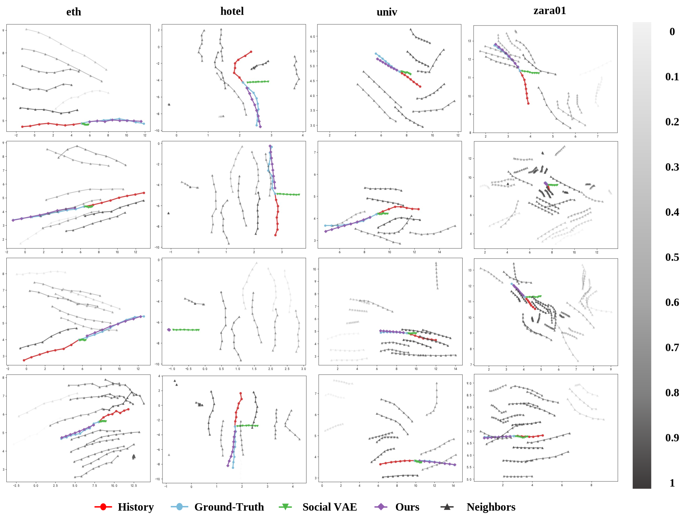
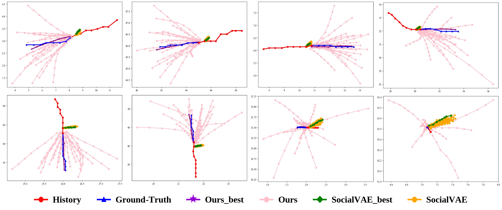

# Full-Attention Interaction and RNN Conditional VAE Based on KANs for Efficient Pedestrian Trajectory Prediction

_**Abstract**_ -- Pedestrian trajectory prediction holds significant importance for smart cities and autonomous driving. Nevertheless, existing approaches exhibit several limitations: a) the uncertainty of the number of neighbors in the scene; b) issues of divergence and uncertainty during the encoding-decoding process; c) the tendency for trajectory predictions to collapse due to overfitting; and d) inefficiencies in macroprocessing. To resolve these challenges, motion states of selected agents and their neighbors are modeled separately based on motion state decomposition. By utilizing the squeeze theorem from mathematics, an encoder is designed that includes a history inference sub-encoder and a future approximation sub-encoder to approximate the distributions of latent variables. Moreover, the historical inference sub-encoder incorporates agent-neighbor interaction attention with full attention interaction to facilitate the efficient and accurate extraction of social intentions. Within the decoder, the RCVAE network is proposed, which preserves social intentions information and decodes the latent variables to generate trajectories for a specified time step. Latent variables are fused with the generated trajectories, and the updating of latent variables is achieved through RNN to mitigate the overfitting phenomenon. Finally, a parallel prediction optimizer is developed based on KANs, which consolidates the time dimensions of the generated trajectories to assess trajectory information from a macroscopic perspective and converges rapidly to achieve the desired prediction outcomes. Experimental results indicate that the method leads to efficient predictions with state-of-the-art performance.

_**Visualisation**_--Our approach is tested on the public datasets ETH/UCY, SDD and NBA. Fig. 1 is visualization of trajectories in complex interaction scenarios. Under the ETH/UCY dataset, we present scenarios with richer social information and more agents. Considering that the zara02 scenario has fewer agents and larger distances, it does not have complex interaction scenarios relative to the previous four scenarios and is therefore not shown. 

As shown in Fig. 2, results of trajectory prediction for the NBA dataset. The first two rows show the prediction results under the rebound subdataset, and the last two rows show the prediction results under the scores subdataset. We also compare the results with existing better methods when zooming in on the local regions. 

Fig. 3 is visualization results of multiple trajectory predictions on the SDD dataset. We compare the 20 prediction results of RCVAE-KANs with the 20 prediction results of the SOTA approach.

## Environment
- Ubuntu 18.04
- Python 3.7.4
- cudnn 8.0.5
- Pytorch 1.11 + cu111
- Numpy 1.21

We recommend to install all the requirements through Conda by

    $ conda create --name <env> --file requirements.txt -c pytorch -c conda-forge

## Code Usage

Command to train a model from scratch:

    $ python main.py --train <train_data_dir> --test <test_data_dir> --ckpt <checkpoint_dir> --config <config_file>

Training and testing data are provided in `data` folder and the configuration files are in `config` folder. 
You can run them to see the results.

    # ETH/UCY
    $ python main.py --train data/eth/train --test data/eth/test --ckpt log_eth --config config/eth.py
    $ python main.py --train data/hotel/train --test data/hotel/test --ckpt log_hotel --config config/hotel.py
    $ python main.py --train data/univ/train --test data/univ/test --ckpt log_univ --config config/univ.py
    $ python main.py --train data/zara01/train --test data/zara01/test --ckpt log_zara01 --config config/zara01.py
    $ python main.py --train data/zara02/train --test data/zara02/test --ckpt log_zara02 --config config/zara02.py

    # SDD
    $ python main.py --train data/sdd/train --test data/sdd/test --ckpt log_sdd --config config/sdd.py

    # NBA
    $ python main.py --train data/nba/rebound/train --test data/nba/rebound/test --ckpt log_rebound --config config/rebound.py
    $ python main.py --train data/nba/score/train --test data/nba/score/test --ckpt log_score --config config/score.py

## Pre-trained Models and Evaluation
Download pre-trained models from: https://pan.baidu.com/s/1koHmnEhLY-dw_VAoi2QJ4Q. code: wa2c.
Put them in the main directory and change the code in socialtrans_test.py that corresponds to the loading model section

    # ETH/UCY
    $ python main.py --test data/eth/test --ckpt models/eth --config config/eth.py
    $ python main.py --test data/hotel/test --ckpt models/hotel --config config/hotel.py
    $ python main.py --test data/univ/test --ckpt models/univ --config config/univ.py
    $ python main.py --test data/zara01/test --ckpt models/zara01 --config config/zara01.py
    $ python main.py --test data/zara02/test --ckpt models/zara02 --config config/zara02.py

    # SDD
    $ python main.py --test data/sdd/test --ckpt models/sdd --config config/sdd_pixel.py

    # NBA
    $ python main.py --test data/nba/rebound/test --ckpt models/nba/rebound --config config/nba_rebound.py
    $ python main.py --test data/nba/score/test --ckpt models/nba/score --config config/nba_score.py

 

## Training New Models

### Prepare your own dataset

Our code supports loading trajectories from multiple files, each representing a scene. Simply split your data into training and testing sets, and save each scene as a `txt` file in the corresponding folder.

Each line in the data files should follow this format:

    frame_ID:int  agent_ID:int  pos_x:float  pos_y:float  group:str

- `frame_ID` and `agent_ID` are integers 
- `pos_x` and `pos_y` are float numbers. 
- The `group` field is optional and can be used to identify the agent type/group. This allows the model to be trained to predict the movements of specific groups/types of agents.

### Setup your config file

We provide our config files in `config` folder, which can be used as reference.

### Training

    $ python main.py --train <folder_of_training_data> --test <folder_of_testing_data> --ckpt <checkpoint_folder> --config <config_file>

### Evaluation

    $ python main.py --test <folder_of_testing_data> --ckpt <checkpoint_folder> --config <config_file>